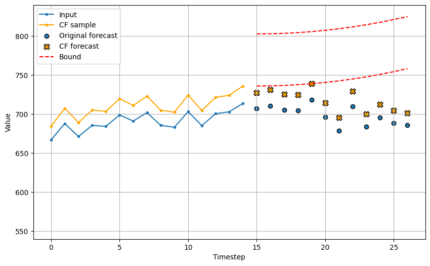
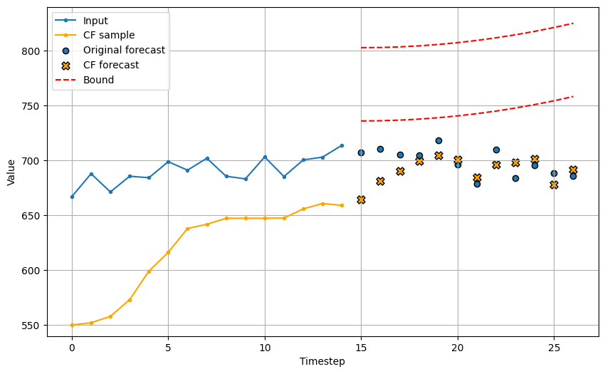

# Counterfactual Explanations for Time Series Forecasting
Counterfactual Explanations for Time Series Forecasting<br/>
Accepted at ICDM 2023<br/>
<!-- [[paper_link]](https://arxiv.org/)
[[slides_TBD]](https://github.com/zhendong3wang/counterfactual-explanations-for-forecasting) 
[[conference_code]](https://github.com/zhendong3wang/counterfactual-explanations-for-forecasting) -->

In this paper, we formulate the novel problem of counterfactual generation for time series forecasting, and propose an algorithm, called **ForecastCF**, that solves the problem by applying gradient-based perturbations to the original time series. ForecastCF guides the perturbations by applying lower and upper bound constraints to the forecasted values to obtain desired prediction outcomes.

<!-- If you find this GitHub repo useful in your research work, please consider citing our paper:
```
@article{wang_style-transfer_2023,
}
``` 
Please also consider citing the original publication:
```
@article{wang_counterfactual_2021,
}
``` 
-->

## Dependencies
For reproducibility, all the experiments and the computational runtime are evaluated with NVIDIA GeForce RTX 2080 (GPU) and AMD Ryzen Threadripper 2950X 16-Core Processor (CPU), with following dependencies:
  - python=3.9
  - cudatoolkit=11.8.0
  - cuda-nvcc=11.3.58

### Installation:
```
pip install -r requirements.txt
```

## Experimental Setup
### Data preparation
We evaluate our proposed ForecastCF algorithm on four benchmark datasets from recent forecasting competitions: 
- *CIF2016*: real-world banking data, 12-month-ahead forecast with different lengths;  
- *NN5*: 56-day-ahead forecast task with 111 daily ATM cash withdrawal data;
- *Tourism*: monthly series with different lengths from 366 countries;
- *M4 Finance*: monthly financial forecasting task, extracted from the M4 competition containing 10,987 series with different lengths; 

Together with two additional datasets in stock marketing and healthcare: 
- *SP500*: originally collected from [Yahoo Finance](https://finance.yahoo.com/), including the Open stock prices of companies based on the S&P500 index between 2013-02-08 and 2018-02-07;
- *MIMIC*: extracted mean arterial pressure (MAP) measurements from 1,035 cardiovascular patients in the [MIMIC-III database](https://physionet.org/content/mimiciii/1.4/), with a hypotension prediction task to forecast an 8-hour-ahead MAP based on the historical 24-hour measurement;

For data pre-processing, an in-sample strategy for the rolling origin evaluation technique is applied, as shown in the [supplementary figure](./supplement_figures/data_train_test_split.png). Specifically, we utilize the temporal order to split each individual time series into training, validation, and testing chunks, based on the split size (e.g., 60%/20%/20%), and then we aggregate the individual chunks into the final training, validation, and test sets. A standard min-max normalization is
applied using scales of the training set.
The summary statistics are described in the [supplementary table](./supplement_figures/data_summary_statistics.png).

### Forecasting models
We evaluate ForecastCF on four DL model architectures:
- *GRU*: a GRU model consists of two consecutive GRU layers with 100 hidden units separately;
- *Seq2seq*: we adopt the [TFTS implementation](https://github.com/LongxingTan/Time-series-prediction) by utilizing 256 units in RNN layers and 256 units for the dense layer;
- *WaveNet*: we adopt [TFTS](https://github.com/LongxingTan/Time-series-prediction) and then modify the default architecture to include the skip connection with the filter size 256;
- *N-Beats*: we apply the [N-Beats implementation](https://github.com/philipperemy/n-beats), where we set the dense layer to 256 hidden units, and keep the remaining default hyperparameters;

### Baseline CF models
We additionally propose two baseline models for the counterfactual generation:
- *BaseNN*: applies the 1-nearest-neighbour approach to retrieve the nearest neighbour from the training set as the counterfactual; it utilizes the Euclidean distance between the desired forecast range (average between the upper and lower bounds) and the values of the forecasting time horizon from the training set;
- *BaseShift*: utilizes a naive shifting technique by directly multiplying the shift factor (i.e., the desired percentage change) with the input series to get the counterfactual;

### Evaluation metrics
For evaluating the predictive performance of the forecasting models, we apply two measures: Symmetric Mean Absolute Percentage Error (sMAPE) and Mean Absolute Scaled Error (MASE).
For the counterfactual evaluation, we adopt evaluation metrics from recent counterfactual studies to forecasting by considering two groups: (a) *validity* (**Validity Ratio** and **Stepwise Validity AUC**) and (b) *data manifold closeness* (**Proximity** and **Compactness**). More detailed definition can be found in the paper. <br/>
We report the average of all test samples for each dataset over five repetition runs (more detailed statistical analysis can be found in the [results folder](./results/)).


## Running the `ForecastCF` method
We formulate the *Polynomial Trend* instantiation for desired trajectory bounds in our experiment. We show that the desired trajectory can be customized to provide the upper bound vector $\alpha$ and the lower bound vector $\beta$, with the following hyperparameters:  
- `c(·)`: center function;
- `s`: shift;
- `fr`: fraction of standard deviation; 
- `cp`: the desired change percent;
- `poly_order`: polynomial order;

where shift `s` and center function `c(·)` (can be either median, max, min, mean, or the last point of the input sample) are defined to choose the starting value of the ''trajectory bounds''; the fraction `fr` is to define the width of the bounds.

Run the following code to reproduce our experiments:
### The first experiment and the horizon test:

```
bash run_first_test.sh
```
```
bash run_horizon_test.sh
```

### Ablation study for two hyperparameters: desired change percent `cp` and fraction of std `fr`:
```
bash run_ablation_percent.sh
```
```
bash run_ablation_fraction.sh
```

### Runtime test:
```
bash run_time_test.sh
```

## Examples
We provide three individual counterfactuals from CIF2016 as a qualitative analysis of the performance difference between ForecastCF and the baseline models:

<!--   -->
<table>
  <tr>
    <td></td>
    <td></td>
    <td></td>
  </tr>
    <tr>
    <td align="center">ForecastCF</td>
    <td align="center">BaseShift</td>
    <td align="center">BaseNN</td>
  </tr>
 </table>

In the examples, the input time series is shown as the blue line, and the counterfactual sample is the yellow line. The red-dotted curves define the forecast constraints that the predicted values (yellow points) of the counterfactuals are more desired to fall into; the blue points denote the forecasted values on the original sample. This comparison can further demonstrate that ForecastCF could generate more proximate and valid counterfactuals for forecasting.

## Results and supplementaries
The results of the quantitative analysis are available in the [results folder](./results/), including aggregated csv files with statistical analysis. All the plots used in the paper can be found in the [plots folder](./plots/). Additionally, our pseudo-code, examples and data plots are available as [supplementary figures](./supplement_figures).

